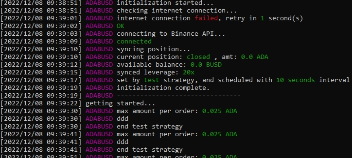

# JAKT: Rules-based Binance Futures Bot


A Rules-based Binance Futures trading bot. Implemented since early 2021, but still work properly till now (late 2022).



> This bot invented by compilation of the famous technical analysis library [TA-LIB](http://ta-lib.org), Python-Binance, Binance-Futures-Connector, and others. The main features of this bot are:
> * Multiple Pairs trade simultaneously
> * Smooth working (as silk, lol) with error exception handling
> * Retry if failed for every possible technical failures
> * Customable your own trading strategy
> * LINE Notification for important events
> * Invented utility features: API connect, Shorted, Longed, Closed, close_all_positions, sync_position, fetch[klines, position, opened_orders, balance, leverage], compare_cress, cal_vector, find_delta, cal_zcross, and others...
> * Operable with popular statistics ie., MA, EMA, MACD, RSI, SAR, etc...

## Warming up
You can easily run this bot with **Docker Compose** by following these steps:

1. Clone and get into this repo:
```bash
git clone https://github.com/geeksloth/binance-futures-bot.git && cd binance-futures-bot
```

2. Change name or copy `config-dist.json` to `config.json` and then add your keys generated from your *Binance API*:
```json
"BinanceAPI": {
  "key": "<binance_futures_api_key>",
  "secret": "<binance_futures_api_secret>",
}
```

3. Add and modify your `pairs` by your own pairs
```json
"pairs": [
  {
    "enable": false,
    "crypto": "BTC",
    "asset": "BUSD",
    "strategy": "MACDez",
    "interval_seconds": 180,
    "color":"LIGHTYELLOW_EX"
  },
  {
  
  }
]
```

4. Review some `strategies` in `jakt_v0.18.1.py` and choose one of them for the previous step. Or you can invent *your own strategy* by using pre-invented utility functions in the script as described above. The basic strategy includings:
```python
if self.strategy == "basic":
  tf="1m"
  closing_data = self.fetch(tf, 50)
  indy["pair"] = self.symbol
  indy[tf]["ema_dif"] = self.getDeltaEMA(closing_data, 5, 10)
  indy[tf]["macd"] = self.getMACD(closing_data)
  indy[tf]["rsi"] = self.getRSI(closing_data)

  if indy[tf]["ema_dif"] >= 0:
    if indy[tf]["macd"] >= 0: # this TF says should take LONG
      predict = 'long'
  else:
    if indy[tf]["macd"] < 0:
      predict = 'short'
```


## Kick it run
After your customization is finished, run the JAKT-bot by:
```bash
docker-compose up
```
That's it! Take your time :)


## More complex strategy
If you like to chanllenge yourself, see following strategy and then invent some by your self:
```python
elif self.strategy == "MACDez":
  action="doing nothing"
  tf="3m"

  closing_data = self.fetch(tf, 200)
  indy["QTY_percent"] = 50
  indy["QTY"] = self.calQTY(closing_data[0], percent=indy["QTY_percent"])
  indy[tf]["MACD_zcross"] = self.getMACD_zcross(closing_data, fastperiod=66, slowperiod=100, signalperiod=33)
  indy[tf]["MACD_vector"] = self.getMACD_vector(closing_data, fastperiod=66, slowperiod=100, signalperiod=33, step=1)
  self.pprint(indy)

  if self.positionState == "closed":
    # this condition is to consider when should taking long or short
    if (indy[tf]["MACD_zcross"] == "nnp"):
      # taking long position
      self.long(indy["QTY"])
      action="open longed order"
    elif (indy[tf]["MACD_zcross"] == "ppn"):
      # taking short position
      self.short(indy["QTY"])
      action="open shorted order"
    else:
      action="waiting for the top and the dip"

  elif self.positionState == "longed":
    if indy[tf]["MACD_vector"] == "udd" or indy[tf]["MACD_vector"] == "ddd":
      # taking close position
      self.close(indy["QTY"])
      action="close a longed position"
    else:
      action="let longed profit run"

  elif self.positionState == "shorted":
    if indy[tf]["MACD_vector"] == "duu" or indy[tf]["MACD_vector"] == "uuu":
      # taking  close position
      self.close(indy["QTY"])
      action="close a shorted position"
    else:
      action="let shorted profit run"
  else:
    self.print("self.positionState invalid: {}".format(self.positionState))

  self.print("{} just {}, current position state: {}".format(self.strategy, action, self.positionState))
```

## Shared with love
If you discover the incredible strategy, please tell me too. Big hug!!!
